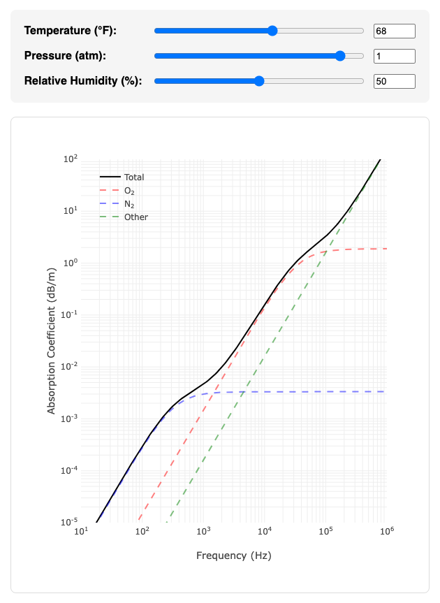
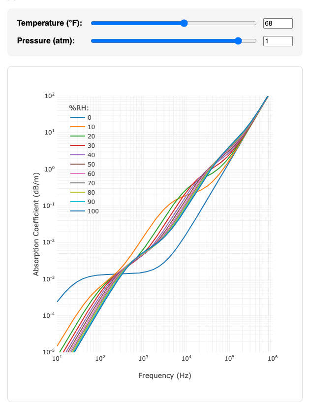

Atmospheric Sound Absorption
============================

This repository contains JavaScript code that computes atmospheric sound
absorption coefficients according to the method of the International
Standard ISO 9613-1:1993. See file `absorption-utils.js` for the code.

The repository also includes a small web application that offers two
interactive, web-based plots that display such coefficients. One of the
plots shows absorption coefficients vs. frequency for a user-specified
temperature, pressure, and humidity. The plot shows the total absorption
coefficient as well as the parts of it due to nitrogen relaxation, oxygen
relaxation, and other processes. It looks like this:

The other plot shows absorption coefficients vs. frequency for a
user-specified temperature and pressure and several fixed humidities.
It looks like this:

To view and interact with the plots, serve the repository directory with
your favorite web server and visit the server's root URL. For example, to
serve with the NPM `http-server` package, type the following commands at
a terminal:

    cd atmospheric-sound-absorption
    http-server

and then visit the following URL in your web browser:

    http://localhost:8080
